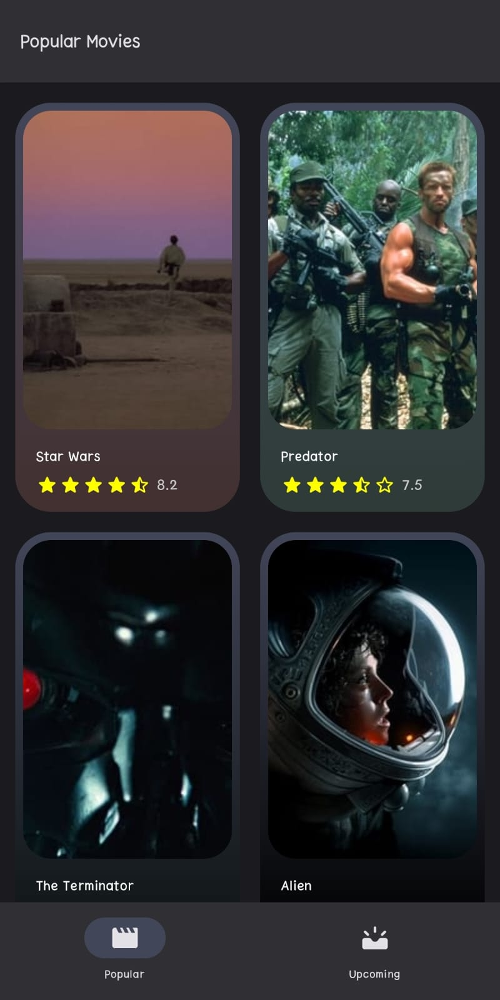
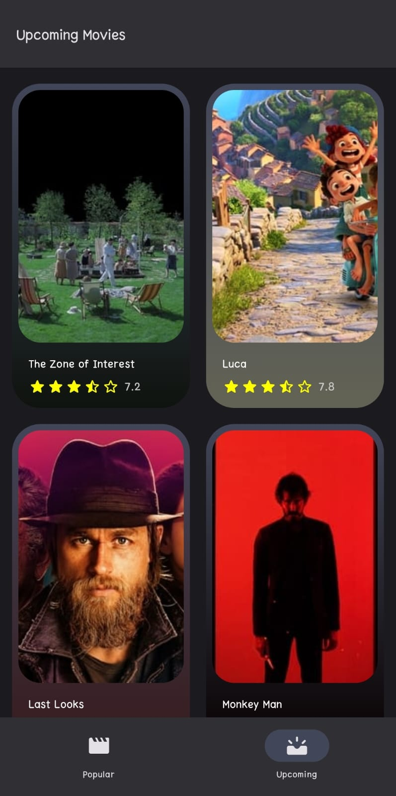
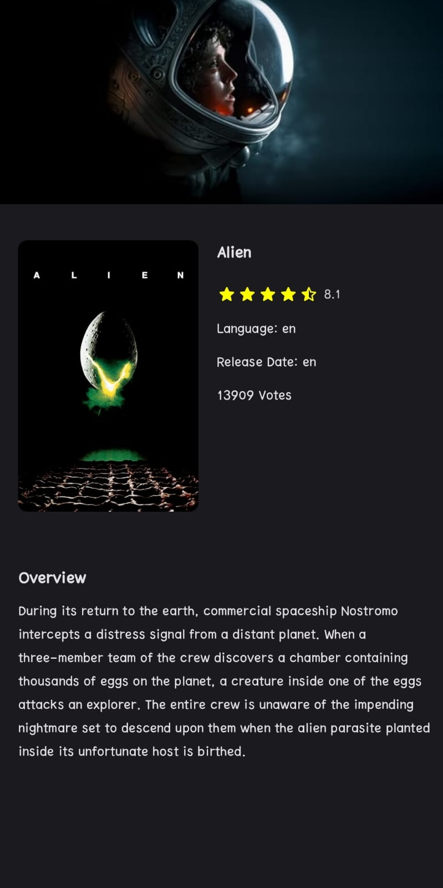

# MoviesAppCompose 

It's an offline first app to display popular movies of all time and track down the upcoming movies. 
&nbsp; 

Project is written in Kotlin.💯
&nbsp; 

| Popular | Upcoming | Details |
|------|------|------|
|  |  |  |
&nbsp; 

**It's recommended to use in dark mode but light mode alternative also presented.
&nbsp; 

## The Aim Of The Project
Develop an app with new technologies and best practices in android development such as:
- [Jetpack Compose](https://developer.android.com/develop/ui/compose) - Jetpack Compose is Android’s recommended modern toolkit for building native UI. It simplifies and accelerates UI development on Android. Quickly bring your app to life with less code, powerful tools, and intuitive Kotlin APIs. &nbsp; 
- [Clean Architecture](https://medium.com/android-dev-hacks/detailed-guide-on-android-clean-architecture-9eab262a9011)  - Clean architecture is a software design philosophy that separates the elements of a design into ring levels. &nbsp; 
- [SOLID](https://medium.com/the-android-caf%C3%A9/solid-principles-the-kotlin-way-ff717c0d60da)  - SOLID is a mnemonic acronym for five design principles intended to make software designs more understandable, flexible, and maintainable. &nbsp; 
- [CICD](https://resources.github.com/ci-cd/)  - CI-CD comprises of continuous integration and continuous delivery or continuous deployment. Put together, they form a CI-CD pipeline, a series of automated workflows that help DevOps teams cut down on manual tasks. &nbsp; 
- [MVVM](https://developer.android.com/topic/libraries/architecture/viewmodel)  - Its principal advantage is that it caches state and persists it through configuration changes. &nbsp; 
- [HILT](https://dagger.dev/hilt)  - Hilt provides a standard way to incorporate Dagger dependency injection into an Android application. &nbsp; 
- [Retrofit](https://square.github.io/retrofit/)  - A type-safe HTTP client for Android and Java. Retrofit turns your HTTP API into a Java interface. &nbsp; 
- [Flows](https://developer.android.com/kotlin/flow)  - In coroutines, a flow is a type that can emit multiple values sequentially, as opposed to suspend functions that return only a single value. &nbsp; 
- [Coroutines](https://kotlinlang.org/docs/reference/coroutines-overview.html)  - In addition to opening the doors to asynchronous programming, coroutines also provide a wealth of other possibilities, such as concurrency and actors. &nbsp; 
- [Room](https://developer.android.com/training/data-storage/room) - The Room persistence library provides an abstraction layer over SQLite to allow fluent database access while harnessing the full power of SQLite. &nbsp; 
- [Coil](https://coil-kt.github.io/coil/) - An image loading library for Android backed by Kotlin Coroutines.
&nbsp; 

### Contributing
- Just make a pull request.
- Get an API key for your own from "https://www.themoviedb.org/"
- Paste that key to "MovieApi.kt" with keyword "API_KEY".
